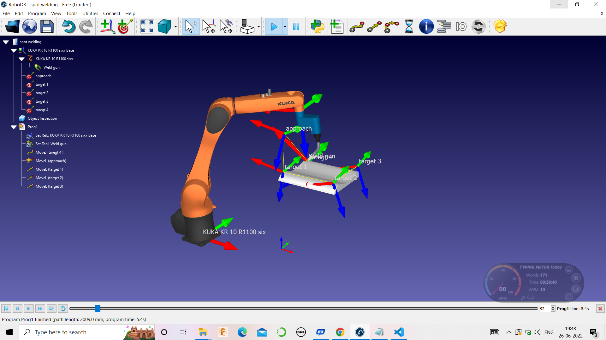
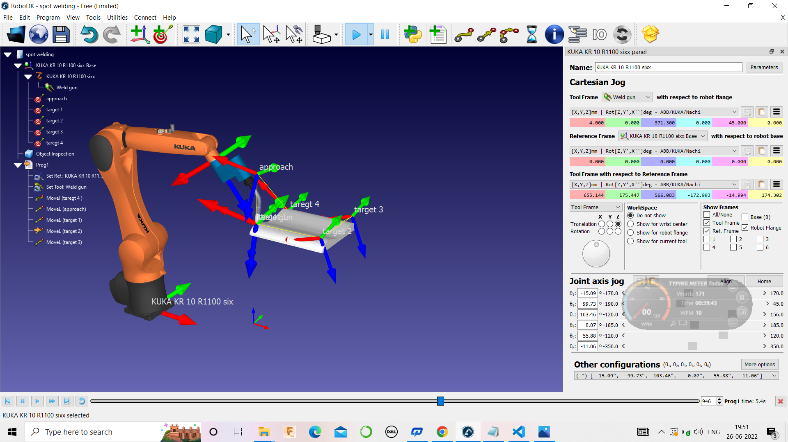
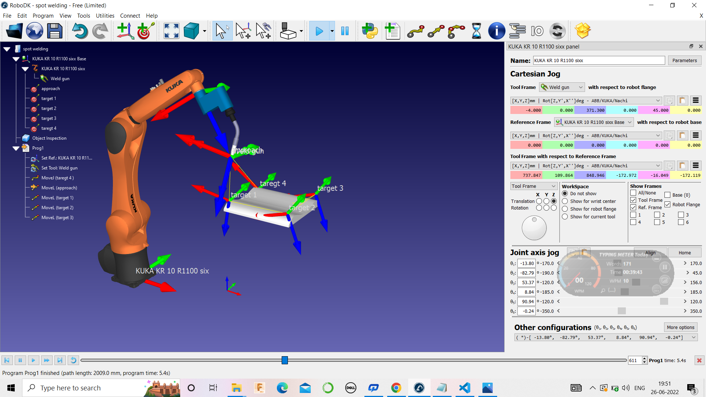

# Lab-Ex.-No---6-Design-simulate-an-environment-for-Welding-using-Robo-DK

 
## AIM:
  To Design & simulate an environment for welding operation using robodk 

## Software  Required:
Robodk

### Theory
When using robots for any process, the method requires amending to accommodate automation. The same is true of welding, which uses several tools not found in its manual equivalent. People don’t need programming the way robotic welders do.

The robot itself has an arm that can move in three dimensions for rectilinear types and through more planes with articulating versions. A wire feeder sends the filler wire to the robot as it needs it for a welding job. A high-heat torch at the end of the arm melts metal to enable the welding process. Because the temperatures reach thousands of degrees, using robots for this process keeps people safer.

Certified human operators still need to remain close to the robots. These workers should hold certification from the American Welding Society, AWS, which certify not only manual welders but also robotic welding arm operators. The operators program the controller using a teach pendant. This device sets new programs, moves the arm and changes parameters for the process. To start the welding, the operator uses the buttons on the operation box.

The tool in the robotic arm heats to melt metal to conjoin the desired pieces. As needed, a wire feeder delivers more metal wire to the arm and torch. When awaiting the next parts to weld, the arm moves the torch to the cleaner to clean any metal splatters from the arm, which could solidify in place without this process.

Because one of the primary reasons to have robotic welders is protecting human workers, these automated systems come with multiple safety features. Arc shields prevent the high-heat arc from mixing with oxygen. Enclosed areas protect operators from the temperatures and bright light.
### ROBOTIC WELDING PROCESSES
Welding requires a high level of education and skill. However, the number of professional welders does not meet the needs of the industry. According to the American Welding Society, by 2022, the industry will experience a shortage of 450,000 welders. Instead of letting critical projects these workers would complete fall behind, robots can pick up the slack.

Robots automate the process, which ensures higher accuracy, less waste and faster operation. With the range of machinery available, robots adapt to a wide variety of welding processes including arc, resistance, spot, TIG and more.

1. ARC WELDING
One of the most common types of robotic welding is the arc process. In this method, an electric arc generates extreme heat, up to 6,500 degrees Fahrenheit, which melts the metal. Molten metal joins parts together, solidifying into a stable connection after cooling. When a project requires a large volume of accurately conjoined metals, arc welding serves as an ideal application.

2. RESISTANCE WELDING
When projects need heat-treating or a way to lower costs, robots may use resistance welding. During this process, a current of electricity creates a pool of molten metal as it passes between the two metal bases. This molten metal joins the pieces of metal together.

3. SPOT WELDING
Some materials resist electrical currents, precluding them from other forms of welding. This situation frequently occurs in the automotive industry for piecing together parts of an automobile body. To overcome the issue, robotic welders use a variation of resistance welding to connect a pair of thin metal sheets in a single spot.

4. TIG WELDING
Robot welding applications requiring high levels of precision may require TIG welding. This method also goes by the term gas tungsten arc welding or GTAW. An electric arc passes between a tungsten electrode and the metal base.

5. MIG WELDING
Gas metal arc welding, also known as GMAW or MIG, is a fast and straightforward method that uses a high level of deposition. A wire moves continuously to the heated tip of the welder, which melts the wire, allowing for a large amount of molten metal to drip onto the base for joining the base to another piece.

6. LASER WELDING
When welding projects require accuracy for a high volume of parts, laser welding is the preferred method of metal joining. Small parts, such as jewelry or medical components often use laser welding.

7. PLASMA WELDING
Plasma welding offers the most significant degree of flexibility because the operator can easily change both the speed of gas passing through the nozzle and the temperature.

### Procedure 

 Import the 3d model in to the project  :
1. Go to the RoboDK tab in SolidWorks and select Auto Setup.
2. Select the welding paths. Make sure to also select the faces as they help orient the robot tool.
3. Now that you have imported the path from SolidWorks, you can go to RoboDK.
4. In the station tree, click Weld1 Settings which will open the Curve Follow Project.
5. Click Update to generate the program and then Simulate.
6. 
First, you should fix the path itself:
1. In the Curve Follow Project, click on Select Curve (going from 1 to 2, then 3 to 4, 5 to 6, 7 to 8, and 9
to 10).
2. The order from the welding sections makes sense. However, the welding direction does not seem to
make sense.
3. To switch the direction of a welding path (such as path 3 to 4), right click the path and select Reverse
direction – you can see that the arrows of that path changed direction.
4. You can do the same for path 5 to 6 and path 7 to 8.
5. Once your modifications are done, you can select Done on the right window.
6. Click Update to generate the program and Simulate to start the simulation.
Now that the order of the paths seems to make more sense, you can adjust the orientation of the tool along the
path to better improve the robot motion.
7. In the Curve Follow Project menu, click on Show preferred tool path. A variety of ghost tools will
appear to show you the orientation of the tool for different positions along the path.
8. The first tool orientation option that you can try is the Path to tool offset around the “Z” axis. To do so,
you can manually enter in a value or bring your mouse over it and use the scroll wheel to bring your value
up or down.
9. By doing this, you can see the orientation of the ghost tool changing
10. 
11. In this case, the basic option does not seem to fix our problem. Fortunately, you can have more options to work
with; you can reveal them by clicking the blue plus button and change them according to your project.
10. You can change the rotation around the Z axis (rotz) to its original value, zero, and then click on the “+Z”
button.
11. As you can see with the ghost tools, the robot flange will always be on top of the part. Click Update and
then Simulate to simulate the result.
12. If you use the scroll bar, the new tool orientation facilitates the cable management of the tool; it has no
risk of interfering with the robot.

1. Put back the default normal approach of 100 mm.
2. Add a movement, for example, along Z.
3. Set it to 50 mm.
4. Press Update and Simulate once you are finished.
5. Now the robot retracts normal to the welding path and then straight up
6. 

### PROGRAM
~~~ 
&ACCESS RVP
&REL 1
&PARAM TEMPLATE = C:\KRC\Roboter\Template\vorgabe
&PARAM EDITMASK = *
DEF Prog1 ( )
EXT BAS (BAS_COMMAND :IN,REAL :IN )

; GLOBAL INTERRUPT DECL 3 WHEN $STOPMESS==TRUE DO IR_STOPM ( )
; INTERRUPT ON 3

;FOLD Initialise and set default speed
BAS (#INITMOV,0)
BAS (#VEL_PTP,100)
BAS (#ACC_PTP,20)
$VEL.CP=0.2
BAS (#TOOL,0)
BAS (#BASE,0)
;ENDFOLD

;;FOLD STARTPOS
;$BWDSTART = FALSE
;PDAT_ACT = PDEFAULT
;BAS(#PTP_DAT)
;FDAT_ACT = {TOOL_NO 0,BASE_NO 0,IPO_FRAME #BASE}
;BAS(#FRAMES)
;;ENDFOLD

$ADVANCE = 5

;FOLD ---- Quickly skip BCO ----
; PTP $AXIS_ACT 
;ENDFOLD

;FOLD ---- GO HOME ----
; PTP {A1 0.000, A2 -90.000, A3 90.000, A4 0.000, A5 0.000, A6 0.000, E1 0, E2 0, E3 0, E4 0, E5 0, E6 0}
;ENDFOLD

; Program generated by RoboDK v5.4.1 for KUKA KR 10 R1100 sixx on 26/06/2022 19:05:55
; Using nominal kinematics.
; ---- Setting reference (Base) ----
$BASE = {FRAME: X 0.000,Y 0.000,Z 0.000,A 0.000,B 0.000,C 0.000}
; BASE_DATA[1] = {FRAME: X 0.000,Y 0.000,Z 0.000,A 0.000,B 0.000,C 0.000}
; $BASE = BASE_DATA[1]
; --------------------------
; ---- Setting tool (TCP) ----
$TOOL = {FRAME: X -4.000,Y 0.000,Z 371.300,A 0.000,B 45.000,C 0.000}
; --------------------------
PTP {A1 -37.61500,A2 -66.12680,A3 64.78780,A4 -4.01055,A5 87.37590,A6 -32.10020,E1 0.00000}
LIN {X 741.007,Y 99.446,Z 857.731,A -172.958,B -15.331,C -171.778,E1 0.00000}
LIN {X 651.176,Y 175.039,Z 566.333,A -172.958,B -15.331,C 174.293,E1 0.00000}
LIN {X 998.363,Y 210.765,Z 544.430,A -175.867,B 14.187,C 174.323,E1 0.00000}
LIN {X 977.965,Y 557.956,Z 525.923,A -175.867,B 14.187,C 174.323,E1 0.00000}
END
~~~

### Results of simulation 

### RESULT

An environment for welding operation using robodk is Designed & simulated.

